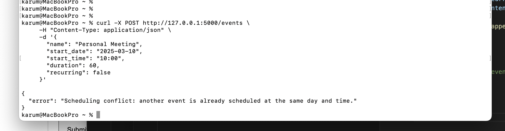
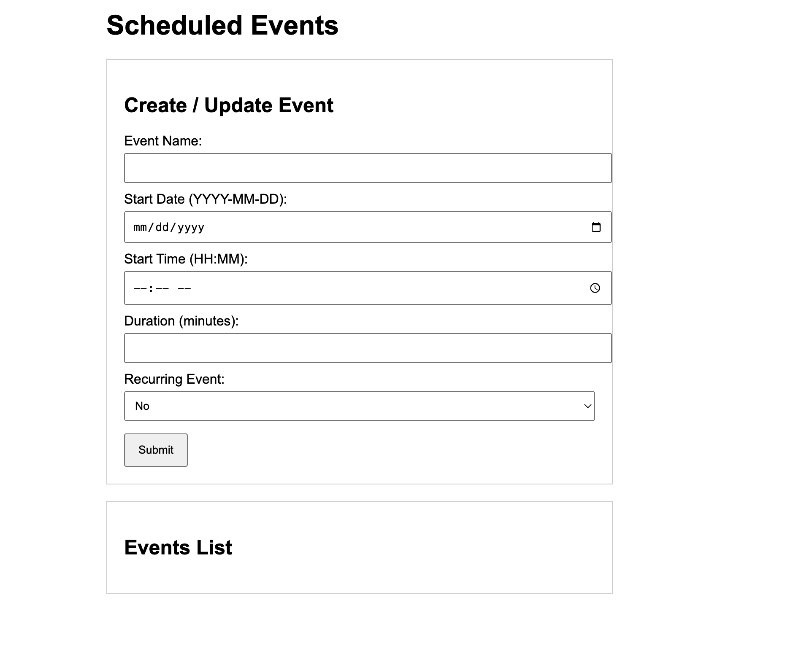

# Scheduled Events API

This project is a server-side application that provides an API for managing scheduled events. The API supports creating, updating, and retrieving events that occur once or recur weekly on specific days. A simple UI mockup (screenshot) is included as a demonstration of the intended frontend design.

## Features

- **One-Time and Recurring Events:**  
  Create events that occur once (with the day derived from the start date) or events that recur weekly on specified days (e.g., every Monday, Wednesday, and Friday).

- **Conflict Checking:**  
  The API ensures that no two events are scheduled at the same start time on overlapping days. If a conflict is detected, the API returns an error.

- **Data Persistence:**  
  Uses SQLite with SQLAlchemy for persistent storage of events.

- **Basic CRUD Operations:**  
  - **Create:** Add new events.
  - **Retrieve:** Get a list of all events or a single event by ID.
  - **Update:** Modify existing events.

- **UI Mockup:**  
  Screenshot of a design is provided as a visual mockup of the interface.

## Installation & Setup

**Prerequisites:**  
- Python 3.7 or higher  
- pip (Python package manager)

**Steps:**

1. **Clone the Repository:**  
   `git clone <repository_url>`  
   `cd event-scheduler-api`

2. **Create a Virtual Environment (optional but recommended):**  
   `python3 -m venv venv`  
   `source venv/bin/activate` (On Windows use: `venv\Scripts\activate`)

3. **Install Dependencies:**  
   Ensure your `requirements.txt` file contains:
    `Flask==2.2.2 Flask-SQLAlchemy==3.0.2 Werkzeug==2.2.3`
   Then install the dependencies with:  
    `pip3 install -r requirements.txt`

4. **Run the Application:**  
`python3 app.py`  
The API will be available at [http://127.0.0.1:5000](http://127.0.0.1:5000).

## API Endpoints

**Retrieve All Events:**  
- **URL:** `/events`  
- **Method:** `GET`  
- **Description:** Retrieves a list of all scheduled events.

**Retrieve a Single Event:**  
- **URL:** `/events/<id>`  
- **Method:** `GET`  
- **Description:** Retrieves details for a specific event by its ID.

**Create an Event:**  
- **URL:** `/events`  
- **Method:** `POST`  
- **Description:** Creates a new event.  
- **Example Payload for a Recurring Event:**
  ```json
  {
    "name": "Yoga Class",
    "start_date": "2025-03-10",
    "start_time": "07:00",
    "duration": 45,
    "recurring": true,
    "days_of_week": ["Monday", "Wednesday", "Friday"]
  }
- **Full CURL command:**
    ```curl -X POST http://127.0.0.1:5000/events -H "Content-Type: application/json" -d '{"name": "Yoga Class", "start_date": "2025-03-10", "start_time": "07:00", "duration": 45, "recurring": true, "days_of_week": ["Monday", "Wednesday", "Friday"]}'```

**Update an Event:**  
- **URL:** `/events/<id>`  
- **Method:** `PUT`  
- **Description:**  Updates an existing event. You can modify fields such as name, start date, start time, duration, recurring flag, or days of the week.  
- **Example Payload for a Recurring Event:**
  ```json
  {
    "name": "Yoga Class",
    "start_date": "2025-03-10",
    "start_time": "08:00",
    "duration": 90,
    "recurring": true,
    "days_of_week": ["Monday", "Wednesday", "Friday"]
  }
- **Full CURL command:**
    ```curl -X POST http://127.0.0.1:5000/events -H "Content-Type: application/json" -d '{"name": "Yoga Class", "start_date": "2025-03-10", "start_time": "08:00", "duration": 90, "recurring": true, "days_of_week": ["Monday", "Wednesday", "Friday"]}'```

## Screenshots

- **Terminal Screenshot**
    
    
